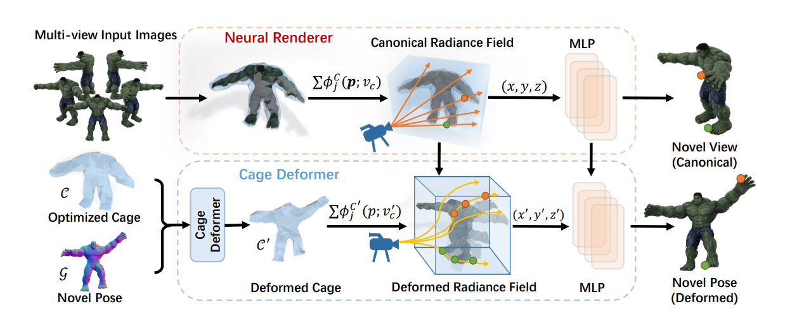

# Abstract
While implicit representations have achieved high-fidelity results in 3D rendering, deforming and animating the implicit field remains challenging. 
Existing works typically leverage data-dependent models as deformation priors, such as SMPL for human body animation. 
However, this dependency on category-specific priors limits them to generalize to other objects. 
To solve this problem, we propose a novel framework for deforming and animating the neural radiance field learned on _arbitrary_ objects. 
The key insight is that we introduce a cage-based representation as deformation prior, which is category-agnostic. 
Specifically, the deformation is performed based on an enclosing polygon mesh with sparsely defined vertices called _cage_ inside the rendering space, where each point is projected into a novel position based on the barycentric interpolation of the deformed cage vertices. 
In this way, we transform the cage into a generalized constraint, which is able to deform and animate arbitrary target objects while preserving geometry details. 
Based on extensive experiments, we demonstrate the effectiveness of our framework in the task of geometry editing, object animation and deformation transfer.

# Overview
## Framework


## Slideshow
<video width=device-width playsinline autoplay loop preload muted controls>
  <source src="assets/media/slide_show.mp4" type="video/mp4">
</video>


Text can be **bold**, _italic_, or ~~strikethrough~~.

[Link to another page](./another-page.html).

There should be whitespace between paragraphs.

There should be whitespace between paragraphs. We recommend including a README, or a file with information about your project.

# Header 1

This is a normal paragraph following a header. GitHub is a code hosting platform for version control and collaboration. It lets you and others work together on projects from anywhere.

## Header 2

> This is a blockquote following a header.
>
> When something is important enough, you do it even if the odds are not in your favor.

### Header 3

```js
// Javascript code with syntax highlighting.
var fun = function lang(l) {
  dateformat.i18n = require('./lang/' + l)
  return true;
}
```

```ruby
# Ruby code with syntax highlighting
GitHubPages::Dependencies.gems.each do |gem, version|
  s.add_dependency(gem, "= #{version}")
end
```

#### Header 4

*   This is an unordered list following a header.
*   This is an unordered list following a header.
*   This is an unordered list following a header.

##### Header 5

1.  This is an ordered list following a header.
2.  This is an ordered list following a header.
3.  This is an ordered list following a header.

###### Header 6

| head1        | head two          | three |
|:-------------|:------------------|:------|
| ok           | good swedish fish | nice  |
| out of stock | good and plenty   | nice  |
| ok           | good `oreos`      | hmm   |
| ok           | good `zoute` drop | yumm  |

### There's a horizontal rule below this.

* * *

### Here is an unordered list:

*   Item foo
*   Item bar
*   Item baz
*   Item zip

### And an ordered list:

1.  Item one
1.  Item two
1.  Item three
1.  Item four

### And a nested list:

- level 1 item
  - level 2 item
  - level 2 item
    - level 3 item
    - level 3 item
- level 1 item
  - level 2 item
  - level 2 item
  - level 2 item
- level 1 item
  - level 2 item
  - level 2 item
- level 1 item

### Small image


### Large image

<!---->


### Definition lists can be used with HTML syntax.

<dl>
<dt>Name</dt>
<dd>Godzilla</dd>
<dt>Born</dt>
<dd>1952</dd>
<dt>Birthplace</dt>
<dd>Japan</dd>
<dt>Color</dt>
<dd>Green</dd>
</dl>

```
Long, single-line code blocks should not wrap. They should horizontally scroll if they are too long. This line should be long enough to demonstrate this.
```

```
The final element.
```
