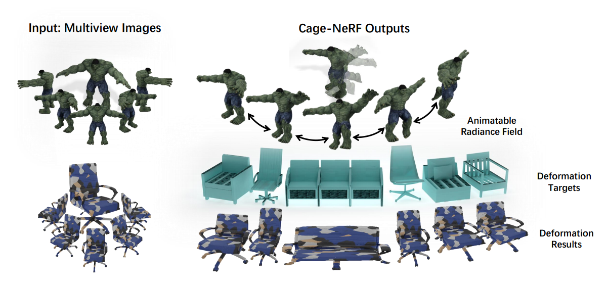
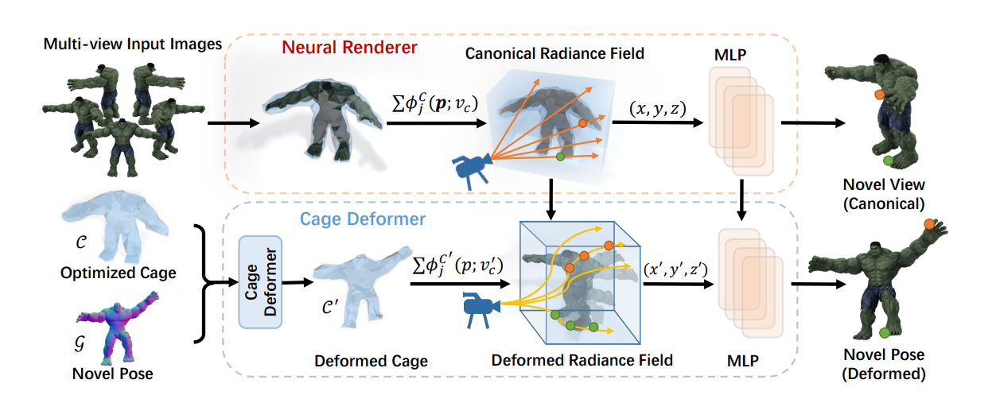
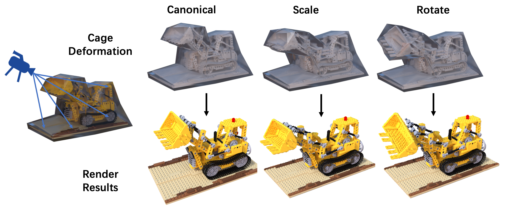
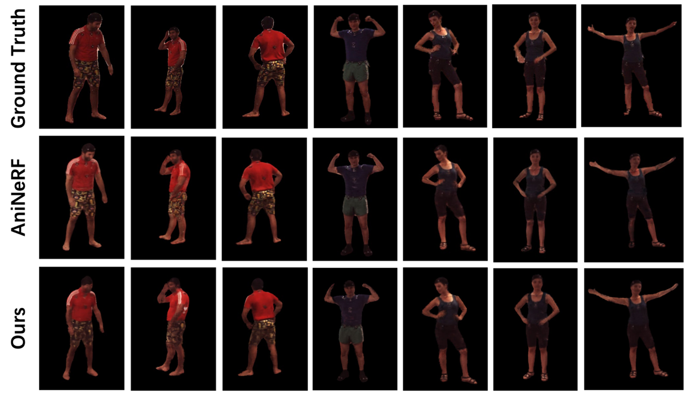

# Abstract


While implicit representations have achieved high-fidelity results in 3D rendering, deforming and animating the implicit field remains challenging. 
Existing works typically leverage data-dependent models as deformation priors, such as SMPL for human body animation. 
However, this dependency on category-specific priors limits them to generalize to other objects. 
To solve this problem, we propose a novel framework for deforming and animating the neural radiance field learned on _arbitrary_ objects. 
The key insight is that we introduce a cage-based representation as deformation prior, which is category-agnostic. 
Specifically, the deformation is performed based on an enclosing polygon mesh with sparsely defined vertices called _cage_ inside the rendering space, where each point is projected into a novel position based on the barycentric interpolation of the deformed cage vertices. 
In this way, we transform the cage into a generalized constraint, which is able to deform and animate arbitrary target objects while preserving geometry details. 
Based on extensive experiments, we demonstrate the effectiveness of our framework in the task of geometry editing, object animation and deformation transfer.

# Overview
## Framework


## Slideshow
<video width="850" playsinline autoplay loop preload muted controls>
  <source src="assets/media/slide_show.mp4" type="video/mp4">
</video>

# Deformable Neural Radiance Fields


# Synthetic Dynamic Human

In comparison with [animatable nerf](https://zju3dv.github.io/animatable_nerf/).

# Project Demo
<video width="850" playsinline autoplay loop preload muted controls>
  <source src="assets/media/demo.mp4" type="video/mp4">
</video>

# Citation
```text
@inproceedings{peng2021CageNeRF，
    title={CageNeRF: Cage-based Neural Radiance Fields for Genrenlized 3D Deformation and Animation},
    author={Peng, Yicong and Yan, Yichao and Liu, Shenqi and Cheng, Yuhao and Guan, Shanyan and Pan, Bowen and Zhai, Guangtao and Yang, Xiaokang},
    booktitle={Thirty-Sixth Conference on Neural Information Processing Systems},
    year={2022}
}
```
